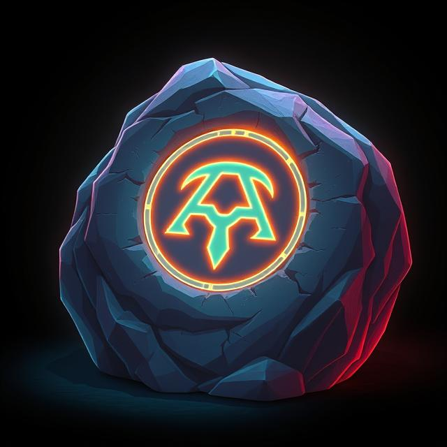

# Rune Chess Engine



[](LICENSE)

**Rune** is a high-performance open-source chess engine written in C++. It supports the Universal Chess Interface (UCI) protocol and is designed for speed, accuracy, and configurability.

---

## Table of Contents
- [First Release Highlights](#first-release-highlights)
- [Features](#features)
- [Search Algorithm](#search-algorithm)
- [Evaluation Algorithm](#evaluation-algorithm)
- [Usage](#usage)
- [UCI Commands](#uci-commands)
- [Configuration](#configuration)
- [Development](#development)
- [License](#license)

---

## First Release Highlights

| Feature | Description |
|---------|-------------|
| UCI Protocol | Full support for GUI integration |
| Opening Book | Precomputed openings with filtering of weak lines |
| Move Generation | Advanced and accurate move generation |
| Evaluation | Handcrafted evaluation function taking into account multiple important factors |
| Search | Negamax framework with alpha-beta pruning using multiple techniques |
| Perft Testing | Debugging and move counting |

---

## Features

- Full UCI protocol support
- Advanced move generation and evaluation
- Opening book support
- Multi-threaded search
- Perft testing for debugging
- Configurable evaluation parameters:
  - Material, piece-square tables, mobility, bishop pair, pawn structure, king safety
- Search options:
  - Quiescence, transposition table, iterative deepening, beta cutoff history
- Custom commands for debugging and board display

---

## Search Algorithm

Rune uses a **Negamax search framework with alpha-beta pruning**, enhanced with several modern techniques:

- **Iterative Deepening**: Searches incrementally from shallow to maximum depth to improve move ordering and time management.
- **Principal Variation Search (PVS)**: Optimizes the alpha-beta search by searching the first move with a full window and others with a null window.
- **Quiescence Search**: Extends search at leaf nodes to capture tactical moves and avoid horizon effect.
- **Transposition Table**: Stores previously computed positions to avoid redundant calculations.
- **Null-Move Pruning**: Skips moves when safe to quickly identify pruning opportunities.
- **Late-Move Reduction**: Reduces the search depth of certain moves if they appear later in the movelist.
- **Move Ordering**: Prioritizes moves using TT move, captures (MVV-LVA), checks, promotions, and beta cutoff history.
- **Static Exchange Evaluation (SEE)**: Estimates material gain for potential captures to improve move ordering.
- **Time Management**: Adjustable think time per move with monitoring for timeouts.

---

## Evaluation Algorithm

Rune's evaluation is **modular and phase-aware**, combining several heuristics:

- **Material Evaluation**: Counts pieces with standard values and adjusts for side-to-move perspective.
- **Piece-Square Tables (PST)**: Scores piece placement differently for opening, middlegame, and endgame phases.
- **Mobility**: Rewards pieces with more legal moves; penalizes king mobility outside endgame.
- **Pawn Structure**: Rewards passed pawns, penalizes doubled or backward pawns.
- **Bishop Pair**: Bonus for possessing a pair of bishops, scaled by game phase.
- **King Safety**:
  - Evaluates pawn shield in front of castled king.
  - Penalizes open/semi-open files near king.
  - Considers enemy attacks and central king exposure.
- **Game Phase Detection**: Dynamically determines if the position is in opening, middlegame, or endgame to scale evaluation weights appropriately.

---

## Usage

Rune runs as a UCI-compatible engine and can be used with any modern GUI such as Arena, CuteChess, or lichess-bot.

Example (command line):

./rune_v1

Example (with CuteChess):

```
cutechess-cli -engine cmd=./rune_v1 name=Rune proto=uci -engine cmd=stockfish name=Stockfish proto=uci -games 10 -each tc=5+0.1
```

## UCI Commands

Rune supports all standard UCI commands:

uci – initialize engine and return options

isready – check readiness

ucinewgame – start a new game

position – set up a position (FEN or moves from startpos)

go – start calculating with parameters (depth, movetime, wtime/btime)

stop – stop calculation

quit – exit engine

## Configuration

### Rune-Specific Options

These internal options (from config.cpp) allow you to fine-tune Rune’s behavior:

| Option Name | Type | Description |
|------------------------------|------|-----------------------------------------------|
| movegenDoLegalMoveFiltering | bool | Enable/disable filtering to only legal moves |
| movegenDoOnlyCaptures | bool | Restrict move generation to captures only |
| evalDoMaterial | bool | Enable/disable material evaluation |
| evalDoPieceSquares | bool | Enable/disable piece-square table evaluation |
| evalDoMobility | bool | Enable/disable mobility evaluation |
| evalDoBishopPair | bool | Enable/disable bishop pair bonus |
| evalDoPawnStructure | bool | Enable/disable pawn structure evaluation |
| evalDoKingSafety | bool | Enable/disable king safety evaluation |
| searchDoQuiescense | bool | Enable/disable quiescence search |
| searchDoTranspositions | bool | Enable/disable transposition table usage |
| searchDoBetaCutoffHistory | bool | Enable/disable beta cutoff history |
| searchDoInfo | bool | Enable/disable detailed search info output |
| searchInitialDepth | int | Initial search depth |
| searchMaximumDepth | int | Maximum search depth |
| searchMaximumQuiescenseDepth | int | Maximum quiescence depth |
| searchDoOpeningBook | bool | Enable/disable opening book usage |

These can be modified via UCI setoption commands, for example:

```
setoption name evalDoMobility value 0
setoption name searchMaximumDepth value 12
```

## Development

Rune is an actively developed project. Contributions are welcome via pull requests and issues.

### Development priorities include:

Improved evaluation (NNUE integration planned)

Endgame tablebase support (Syzygy)

Better time management heuristics

Search pruning and extensions

If you are interested in contributing, check out the issues page.

## License

Rune is released under the MIT License.

You are free to use, modify, and distribute Rune in both commercial and non-commercial projects, provided proper attribution is given.
